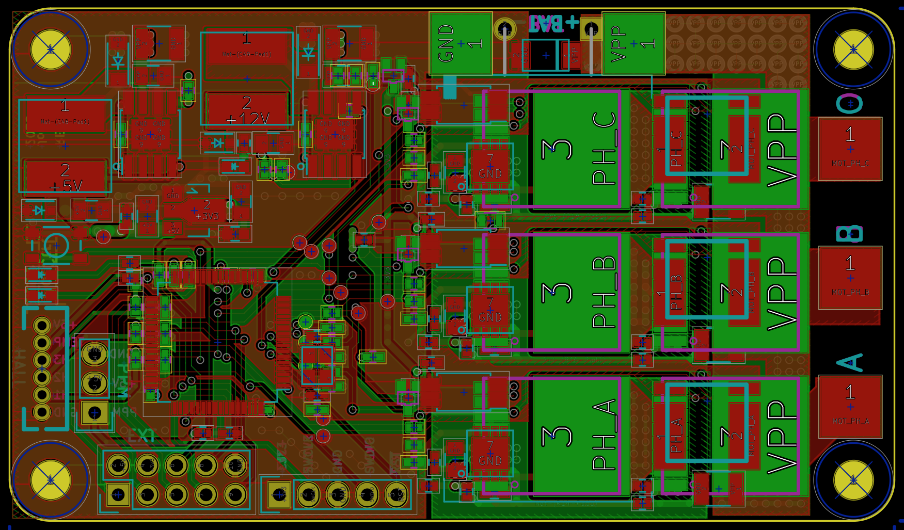
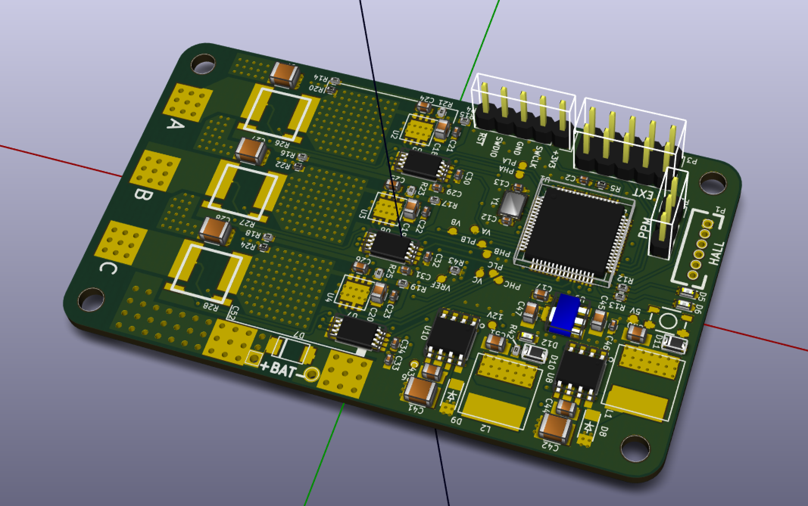

MotCtrl
=========================== 

A small inverter for brushless motors. 

## Hardware

* Microcontroller STM32F446, ARM Cortex-M4, 180 MHz, FPU
* Power MOSFETs 60 V, 300 A, 1.1 mOhm FDBL0110N60
* High- and low-side gate drivers LM5101A
* Inline phase current sensing using INA240 amplifiers
* Hall-sensor inputs
* Standard servo (PPM/PWM) input
* Motor and board temp sensor (NTC)
* Expansion header for UART/ADC/DAC/SPI/I2C/CAN
* PCB size 45x77 mm

